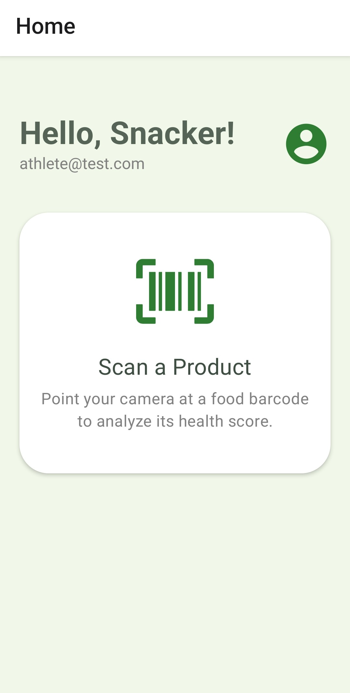

# 🍎 SnackSense: AI-Powered Food Analyst


> **"A smart nutritionist in your pocket."**
> SnackSense uses Computer Vision and Generative AI to analyze food ingredients and provide personalized health insights based on your specific lifestyle goals.

---

## 📱 App Demo

<p align="center">
  
</p>

*Scanning a product to receive instant, personalized health analysis.*

---

## 🚀 Key Features

### 🔍 AI-Powered Scanning
* **Computer Vision:** Uses **Expo Camera** to capture and decode barcodes (EAN-13, UPC, etc.) instantly.
* **Data Enrichment:** Fetches detailed nutritional data (ingredients, allergens, nutriments) from the **Open Food Facts API**.
* **Generative Analysis:** Sends data to **Google Gemini 3.0 Flash** to generate a "Health Score" (0-100) and a verdict based on complex nutritional interactions.

### 🧠 Personalized Health Engine
* **User Context:** Captures user lifestyle data (Sedentary vs. Active, Weight Loss vs. Muscle Gain).
* **Dynamic Prompt Engineering:** The AI adjusts its advice based on who is scanning.
    * *Example:* A high-sugar energy drink might be rated "Beneficial" for an Athlete but "Harmful" for a Sedentary office worker.

### 🔒 Secure Architecture
* **Authentication:** Robust Email/Password login flow powered by **Firebase Auth**.
* **Data Persistence:** User sessions are persisted using `AsyncStorage`, and profile data is stored securely in **Cloud Firestore**.
* **Row-Level Security:** Firestore security rules ensure users can only access their own sensitive health data.

### 🎨 Modern UI/UX
* **Design System:** Built with **React Native Paper** using a custom "Healthy Green" theme.
* **Feedback Loops:** Features smooth fade-in animations, skeleton loaders, and success states (e.g., Green Checkmark overlay).
* **State Management:** Uses **Redux Toolkit** for predictable state updates across Scanning, Auth, and Analysis features.

---

## 🛠️ Tech Stack

* **Frontend:** React Native (Expo SDK 52), TypeScript
* **State Management:** Redux Toolkit, React-Redux
* **UI Library:** React Native Paper, React Native Vector Icons
* **Backend / BaaS:** Firebase (Auth, Firestore)
* **AI Model:** Google Gemini 3.0 Flash (via Google Generative AI SDK)
* **External APIs:** Open Food Facts API

---

## ⚙️ Installation & Setup

Follow these steps to run the project locally.

### 1. Clone the repository
```bash
git clone "https://github.com/yourusername/snacksense.git"
cd snacksense
```
### 2. Install Dependencies
```bash
npm install
```
### 3. Configure Environment Variables
Create a file named `.env` in the root directory. Add your API keys:

```env
# Firebase Configuration
EXPO_PUBLIC_FIREBASE_API_KEY=your_firebase_api_key
EXPO_PUBLIC_FIREBASE_AUTH_DOMAIN=your_project_id.firebaseapp.com
EXPO_PUBLIC_FIREBASE_PROJECT_ID=your_project_id
EXPO_PUBLIC_FIREBASE_STORAGE_BUCKET=your_project_id.firebasestorage.app
EXPO_PUBLIC_FIREBASE_MESSAGING_SENDER_ID=your_sender_id
EXPO_PUBLIC_FIREBASE_APP_ID=your_app_id

# Google Gemini AI
EXPO_PUBLIC_GEMINI_API_KEY=your_gemini_api_key
```
### 4. Run the App
Start the Metro Bundler:

```bash
npx expo start --clear
```
* **Physical Device:** Download the "Expo Go" app (iOS/Android) and scan the QR code.
* **Emulator:** Press `a` for Android Emulator or `i` for iOS Simulator.

---

## 🔮 Future Roadmap

- [ ] **History Tab:** Save previously scanned items to a history list.
- [ ] **Social Sharing:** Share your "Health Score" on Instagram/WhatsApp.
- [ ] **Comparison Mode:** Scan two items to see which one is healthier.
- [ ] **Offline Mode:** Cache recent scans for offline access.

---

## 👨‍💻 Author

**Yasin**

* Full Stack Developer | AI Enthusiast
* [GitHub Profile](https://github.com/Yasin-shaik)
* [LinkedIn](https://www.linkedin.com/in/md-yasin-shaik/)

---

*Built with ❤️ and Caffeine.*